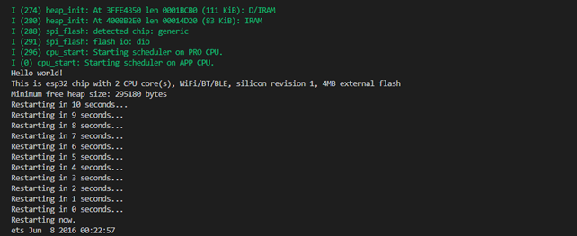
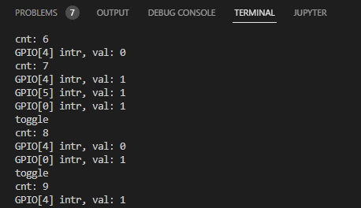

# Prática 2

## Procedimento 1 e 2) Saída do terminal:

Print do terminal

 Observando o output do terminal podemos ver que as interrupções acontecem em borda de subida para o GPIO[5] e nas duas bordas para o GPIO[4].

O programa cria uma função de task que é chamada quando a interrupção do GPIO[4] e GPIO[5] são chamadas, neste caso podemos considerar que possuímos 2 tasks diferentes que gerenciam interrupções mais a “app_main” que  roda no início do programa.

O programa funciona da seguinte forma: 1 – São criadas as configurações necessárias para seu funcionamento (interrupção, task, main, ...); 2 - A main começa a contar baseado nos ticks do programa; 3 – Em valores ímpares de contagem os Outputs configurados vão para nível lógico ‘1’ e em valores pares eles vão para ‘0’; 4 – Com os inputs ligados via hardware aos outputs, eventos de interrupção são gerados com base nas bordas configuradas; 5 – A interrupção chama a Queue e a preenche como uma task que é chamada para atender a fila; 6 – A task chamada conclui sua operação e volta a main.   

## 3)
 Toda vez que o o push buttom do BOOT for apertado GPIO[0], cria uma borda de subida que chama a interrupção. Um printf(“toggle \n”) foi adicionado para mostrar quando o led comuta.

