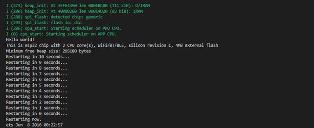

# Prática 1 

## Procedimento 1 ao 3:
Print do terminal

 
## 4)
 É por causa do uso da função printf() pelo programa que devemos incluir o arquivo- cabeçalho stdio.h . A função printf() neste caso irá apenas colocar a string na tela do computador. Ela é utilizada imprimir na tela/ terminal valores e ou texto.

## 5)
 O printf da linha 41 foi adicionado para nos mostrar qual o motivo da reinicialização.  
