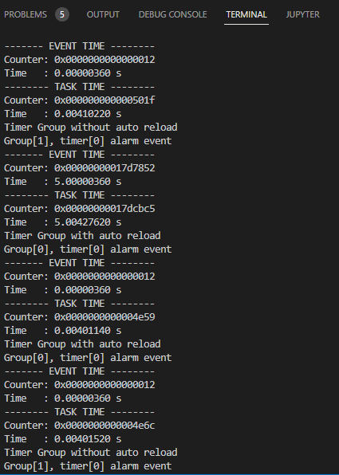

# Prática 

## Procedimento 1 ao 3:
Print do terminal


 

São mostrados os tempos para o acontecimento do evento e da task dos timers com e sem a configuração de auto-reload. É possível observar que existe um tempo até a execução da task e o acontecimento da interrupção (evento).


## 3

```
#include <stdio.h>
#include "freertos/FreeRTOS.h"
#include "freertos/task.h"
#include "freertos/queue.h"
#include "driver/timer.h"

#define TIMER_DIVIDER         (16)  //  Hardware timer clock divider
#define TIMER_SCALE           (TIMER_BASE_CLK / TIMER_DIVIDER)  // convert counter value to seconds

typedef struct {
    int timer_group;
    int timer_idx;
    int alarm_interval;
    int counter_dir;
    bool auto_reload;
} example_timer_info_t;

/**
 * @brief A sample structure to pass events from the timer ISR to task
 *
 */
typedef struct {
    example_timer_info_t info;
    uint64_t timer_counter_value;
} example_timer_event_t;

static xQueueHandle s_timer_queue;

/*
 * A simple helper function to print the raw timer counter value
 * and the counter value converted to seconds
 */
static void inline print_timer_counter(uint64_t counter_value)
{
    printf("Counter: 0x%08x%08x\r\n", (uint32_t) (counter_value >> 32),
           (uint32_t) (counter_value));
    printf("Time   : %.8f s\r\n", (double) counter_value / TIMER_SCALE);
}

static bool IRAM_ATTR timer_group_isr_callback(void *args)
{
    BaseType_t high_task_awoken = pdFALSE;
    example_timer_info_t *info = (example_timer_info_t *) args;

    uint64_t timer_counter_value = timer_group_get_counter_value_in_isr(info->timer_group, info->timer_idx);

    /* Prepare basic event data that will be then sent back to task */
    example_timer_event_t evt = {
        .info.timer_group = info->timer_group,
        .info.timer_idx = info->timer_idx,
        .info.auto_reload = info->auto_reload,
        .info.alarm_interval = info->alarm_interval,
        .info.counter_dir = info->counter_dir,
        .timer_counter_value = timer_counter_value
    };

    if (!info->auto_reload) {
        if(!info->counter_dir){
            timer_counter_value -= info->alarm_interval * TIMER_SCALE;
        }
        else{
            timer_counter_value += info->alarm_interval * TIMER_SCALE;
        }
        timer_group_set_alarm_value_in_isr(info->timer_group, info->timer_idx, timer_counter_value);
    }

    /* Now just send the event data back to the main program task */
    xQueueSendFromISR(s_timer_queue, &evt, &high_task_awoken);

    return high_task_awoken == pdTRUE; // return whether we need to yield at the end of ISR
}

/**
 * @brief Initialize selected timer of timer group
 *
 * @param group Timer Group number, index from 0
 * @param timer timer ID, index from 0
 * @param auto_reload whether auto-reload on alarm event
 * @param timer_interval_sec interval of alarm
**/

static void example_tg_timer_init(int group, int timer, bool auto_reload, int timer_interval_sec, int COUNTER_DIR)
{
    /* Select and initialize basic parameters of the timer */
    timer_config_t config = {
        .divider = TIMER_DIVIDER,
        .counter_dir = COUNTER_DIR,
        .counter_en = TIMER_PAUSE,
        .alarm_en = TIMER_ALARM_EN,
        .auto_reload = auto_reload,
    }; // default clock source is APB
    timer_init(group, timer, &config);

    /* Timer's counter will initially start from value below.
       Also, if auto_reload is set, this value will be automatically reload on alarm */
    timer_set_counter_value(group, timer, 0);

    /* Configure the alarm value and the interrupt on alarm. */
    timer_set_alarm_value(group, timer, timer_interval_sec * TIMER_SCALE);

    if(!COUNTER_DIR){
        timer_set_counter_value(group, timer, 300 * TIMER_SCALE);
        timer_set_alarm_value(group, timer, (300 - timer_interval_sec) * TIMER_SCALE);
    }

    timer_enable_intr(group, timer);

    example_timer_info_t *timer_info = calloc(1, sizeof(example_timer_info_t));
    timer_info->timer_group = group;
    timer_info->timer_idx = timer;
    timer_info->auto_reload = auto_reload;
    timer_info->alarm_interval = timer_interval_sec;
    timer_info->counter_dir = COUNTER_DIR;
    timer_isr_callback_add(group, timer, timer_group_isr_callback, timer_info, 0);

    timer_start(group, timer);
}

void app_main(void)
{
    s_timer_queue = xQueueCreate(10, sizeof(example_timer_event_t));

    example_tg_timer_init(TIMER_GROUP_0, TIMER_0, true, 3, TIMER_COUNT_UP);
    example_tg_timer_init(TIMER_GROUP_1, TIMER_0, false, 5, TIMER_COUNT_UP);
    example_tg_timer_init(TIMER_GROUP_1, TIMER_1, false, 7, TIMER_COUNT_DOWN);

    while (1) {
        example_timer_event_t evt;
        xQueueReceive(s_timer_queue, &evt, portMAX_DELAY);

        /* Print information that the timer reported an event */
        if (evt.info.auto_reload) {
            printf("Timer Group with auto reload\n");
        } else {
            printf("Timer Group without auto reload\n");
        }
        printf("Group[%d], timer[%d] alarm event\n", evt.info.timer_group, evt.info.timer_idx);

        /* Print the timer values passed by event */
        printf("------- EVENT TIME --------\n");
        print_timer_counter(evt.timer_counter_value);

        /* Print the timer values as visible by this task */
        printf("-------- TASK TIME --------\n");
        uint64_t task_counter_value;
        timer_get_counter_value(evt.info.timer_group, evt.info.timer_idx, &task_counter_value);
        print_timer_counter(task_counter_value);
    }
}


```